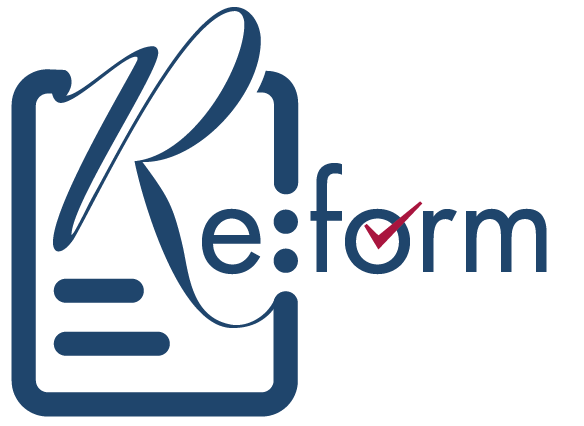

<a name="readme-top"></a>

<!-- [![Contributors][contributors-shield]][contributors-url]
[![Forks][forks-shield]][forks-url]
[![Stargazers][stars-shield]][stars-url]
[![Issues][issues-shield]][issues-url]
[![MIT License][license-shield]][license-url]
[![LinkedIn][linkedin-shield]][linkedin-url] -->

<div align="left">
<picture>
 <source media="(prefers-color-scheme: dark)" srcset="images/ReFormBeautyDarkLogo.png">
 <source media="(prefers-color-scheme: light)" srcset="images/ReFormBeautyLightLogo.png">
 
</picture>
  <br />
  <br />
  <h2>Make Beauty Safe. ReForm it.</h2>
  <p>
  <p align="left">The beauty industry exists to enhance the way people look. To make them more attractive and help them feel great about themselves.</p>
    <p align="left">Professional therapists are skilled in treatments which are frequently complex to administer.
    But in the wrong hands, they can also be dangerous or even life-threatening.</p>
    <p align="left">We created ReFormBeauty app to make the industry safer for both customers and professional practitioners.</p>
    <p align="left">And even better, we make the experience of consultations more efficient and relevant for all.</p>
    <br />
  </p>
</div>

# About The Project

> A person having a non-surgical cosmetic intervention has no more protection and redress than someone buying a ballpoint pen or a toothbrush. **_Professor Sir Bruce Keogh_**

## Core team of three

- Subject Matter Expert: Alice Kent is a professional beauty therapist.
- Technology: Bill Lanyon is Economist by training, technologist by inclination and Agile by experience.
- Operations: Nigel Kent is an experienced owner and manager of UK and USA businesses.

## ReFormBeauty app

- **Securely captures** medical profile from the customer; profile and qualification information from the therapist; insurance and licensing information from the provider.
- **Flightchecks** when a customer selects a treatment, verifies that the treatment is safe for them and the therapist they choose is genuine and qualified.
- **Handshakes** at the point of treatment creating a standard contract for the course of treatment and consistent treatment record for insurance purposes.

## Project built with:

- ![javascript.shield]
- ![react.shield]
- ![remix.shield]
- ![prisma.shield]
- ![mongodb.shield]
- ![cypress.shield]
- ![githubactions.shield]

# Design Decisons

## Progressive Web App (PWA): optimise distribution

- Native app advantages: faster than web apps; can access system & device resources; can work without an internet connection; have more safety and security with App Store approval; user engagement time; findability on app stores.
- Native app limitations: not auto updating; design, build, maintenance and update for two platforms is more expensive; apps have to be approved by the App Stores; Apple and Google charges; Reach of web today.
- PWA advantages: cross platform compatible; cost and effort effective:; works with low network bandwidth; auto updates; no dependency for distributing apps; many native app features; https security; consume less disk space.
- PWA limitations: difficult to optimize device resources; hard to work with device-specific features; limited functionality support.
- Conclusion: PWA

## Single Page App (SPA): React.js with server-side rendering to optimise mobile experience

- A Facebook open source project with a strong community, helping future-proof our code. Netflix and Airbnb are examples of React.js
- Component logic is written in JavaScript and JSX instead of templates with faster SPA performance than Angular or Vue.js
- Declarative views make code more predictable, easier to debug and more maintainable.

## CSS: Tailwind utility framework
- Vanilla css: Pros are full control, no unnecessaary code, class name freedom; Cons are build everything from scratch, danger of bad code.
- Component frameworks (eg. Bootstrap): Pros are: fast development, follow best practices, no need for expertise; Cons are: little or no control, unnecessary overhead code, "All websites risk to look the same".
- Utility frameworks: Pros are faster development, follow best practice, less need for expertise; Cons are little control, necessary overhead code 

## Database: NoSQL MongoDB

- With NoSQL we can flexibly optimise our DB structure to make the queries as efficient as possible.
- Data which is frequently queried together is typically stored together, to avoid having to JOIN data. Some data duplication is OK if the data is not going to change often, but nested data that could grow infinitely (eg. reviews) has to be avoided.
- The scale-out architecture of NoSQL systems provides a clear path to scalability when data volume or traffic grows.
- We will precompute health profiles at against treatment type to prepare boolean gating data by treatment.
- Single lookup of all profile data, by embedding to avoid the expense of JOINs or $lookup?s
- Optimise wil be based on: frequency, size, integrity, maximum latency, execution time and 6 year retention life.
- We will use the Prisma object relational mapping (ORM) bridge to a local MongoDB testing database for development.
- Rough Entity Relationship Diagram (ERD):
  ![erd]

## Web Security: apply the AWS Zero Trust Model

- Always prioritise escaping all incoming user input content to treat it as raw text.
- Ensure each agent only has the minimal permissions necessary.
- Encrypt our data everywhere, both in transit and at rest.
- Minimise the attack surface to our virtual private cloud.
- Use application load balancer to handle all internet-facing traffic.
- Make sure all internal services are cut off from direct public internet access.
- Apply a web application firewall to further restrict traffic into our network.

## Serverless Architecture: performance needs vs. costs

- Lower costs: on-demand scaling and no idle capacity cost.
- More Agile: high availability and faster innovation.
- Focus on our code: no server management overhead.

## Framework: Remix

- Remix is a seamless server and browser runtime that provides fast page loads and instant transitions by leveraging distributed systems and native browser features instead of clunky static builds.
- Built on the Web Fetch API (instead of Node) it can run anywhere. It already runs natively on Cloudflare Workers, and supports both serverless and traditional Node.js environments.
- Most web apps fetch inside components, creating request waterfalls, slower loads, and unsatisfactory UX.
- Using nested routes, Remix can eliminate nearly every loading state, by loading data in parallel on the server and sending a fully formed HTML document.
- Remix runs the action server side, revalidates data client side, and even handles race conditions from resubmissions.

## Testing: Cypress
- Test driven Development: Cypress helps set up and start writing tests while you build your application locally.
- After building a suite of tests and integrating Cypress with a CI Provider: Cypress Cloud can record your test runs.
- Time Travel: Cypress takes snapshots as your tests run. Hover over commands in the Command Log to see exactly what happened at each step.
- Automatic Waiting: Never add waits or sleeps to your tests. Cypress automatically waits for commands and assertions before moving on.
- Spies, Stubs and Clocks: Verify and control the behavior of functions, server responses, or timers.
- Network Traffic Control: Easily control, stub, and test edge cases without involving servers.
- Screenshots and Videos: screenshots taken automatically on failure, and videos of entire test suite when run from the CLI.
- Cross browser Testing: Run tests within Firefox and Chrome-family browsers locally and optimally in a Continuous Integration pipeline.

## CI Provider: GitHub actions
- Run a workflow on any GitHub event like push, issue creation, or a new release.
- See workflow run in realtime with color and emoji.
- Combine and configure actions for the services we use, built and maintained by the community.
- Pair GitHub Packages with Actions to simplify package management, including version updates, CDN distribution and dependency resolution.


## Production Stack?

- AWS, dynamodb, github actions, auth, tailwind, cypress, vitest, testing library, prettier, eslint, typescript?
- Deployed to a serverless function running Node.js with DynamoDB for persistance.

# Scope

- Order of battle: tracer bullets, proof of concept (POC), therapist prototype, customer prototype, minimum viable product (MVP).
- We have gathered requirements into around 100 user stories that are blueprints for development.
- Tracer bullet code will answer questions that came out of the planning process, hitting all of the major components (user interface, authorisation, business logic and database), to see how things may work in practice.
- Tracer bullets are timeboxed to take from one to five days, check that all the components work together and immediately pivot when they don’t.
- POC scope is defined as the minimum set of user requirements to demonstrate the system from end to end.

## Roadmap

- 000 Therapist Profile: As a Therapist I want to create my secure user access, accept T&Cs, manage my password and preferred communications settings, so that I can access the app securely.
- 001 Therapist Profile: As a Therapist I want to populate my Therapist profile page details: contact details, work address, remote service: so that I can be identified and contacted.
- 002 Therapist Profile: As a Therapist I want to be able to enter and share my covid-19 test and vaccination status, so that I can show my ability to operate during the pandemic.
- 003 Therapist Profile: As a Therapist I want to select the Provider(s) I am working for, so that I can apply the Provider’s contract, insurance and ownership of CustomerTreatmentRecord to the treatments I perform for the Provider as a TherapistAgent.
- 004 Therapist Profile: As a Therapist I want to search for amd select my educational and manufacturer Therapist qualifications, so that I can share the specific treatments I am qualified to provide.
- 005 Therapist Profile: As a Therapist I want to search for and select the ReFormBeauty treatments I am qualified to provide, so that I can share my ReFormBeauty secured services accurately.
- 006...

<!--

See the [open issues](https://github.com/billlanyon/ReFormBeauty/issues) for a full list of proposed features (and known issues). -->

<!-- GETTING STARTED

# Getting Started

To get a local copy up and running follow these simple example steps:

## Prerequisites

This is an example of how to list things you need to use the software and how to install them.

- npm
  ```sh
  npm install npm@latest -g
  ```

### Installation

1. Clone the repo
   ```sh
   git clone https://github.com/billlanyon/ReFormBeauty.git
   ```
2. Install NPM packages
   ```sh
   npm install
   ```
-->

<!-- USAGE EXAMPLES

# Usage

Use this space to show useful examples of how a project can be used. -->

# Contact

Bill Lanyon: billlanyon@me.com

Project Link: [https://github.com/billlanyon/ReFormBeauty](https://github.com/billlanyon/ReFormBeauty)

Web site: [ReFormBeauty](https://ReFormBeauty.org)

[contributors-shield]: https://img.shields.io/github/contributors/billlanyon/ReFormBeauty.svg?style=for-the-badge
[contributors-url]: https://github.com/billlanyon/ReFormBeauty/graphs/contributors
[forks-shield]: https://img.shields.io/github/forks/billlanyon/ReFormBeauty.svg?style=for-the-badge
[forks-url]: https://github.com/billlanyon/ReFormBeauty/network/members
[stars-shield]: https://img.shields.io/github/stars/billlanyon/ReFormBeauty.svg?style=for-the-badge
[stars-url]: https://github.com/billlanyon/ReFormBeauty/stargazers
[issues-shield]: https://img.shields.io/github/issues/billlanyon/ReFormBeauty.svg?style=for-the-badge
[issues-url]: https://github.com/billlanyon/ReFormBeauty/issues
[license-shield]: https://img.shields.io/github/license/billlanyon/ReFormBeauty.svg?style=for-the-badge
[license-url]: https://github.com/billlanyon/ReFormBeauty/blob/master/LICENSE.txt
[linkedin-shield]: https://img.shields.io/badge/-LinkedIn-black.svg?style=for-the-badge&logo=linkedin&colorB=555
[linkedin-url]: https://linkedin.com/in/billlanyon
[aws-architecture]: images/ArchitectureAWS.png
[erd]: images/ERDRough.png
[product-screenshot]: images/screenshot.png
[javascript.shield]: https://img.shields.io/badge/JavaScript-blue?logo=javascript
[react.shield]: https://img.shields.io/badge/React-blue?logo=react
[remix.shield]: https://img.shields.io/badge/Remix-blue?logo=remix
[prisma.shield]: https://img.shields.io/badge/Prisma-blue?logo=prisma
[mongodb.shield]: https://img.shields.io/badge/MongoDB-blue?logo=mongodb
[cypress.shield]: https://img.shields.io/badge/Cypress-blue?logo=cypress
[githubactions.shield]: https://img.shields.io/badge/Githubactions-blue?logo=githubactions
[reformbeauty]: https://ReFormBeauty.org

<p align="right">(<a href="#readme-top">back to top</a>)</p>
